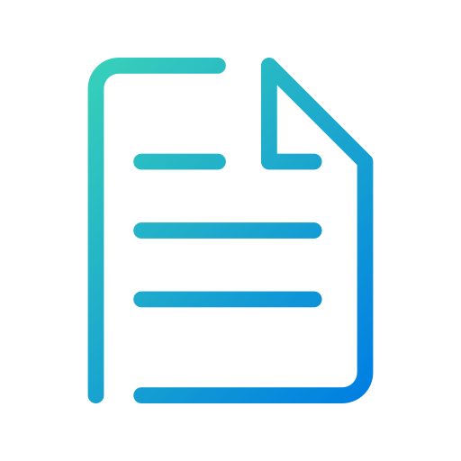
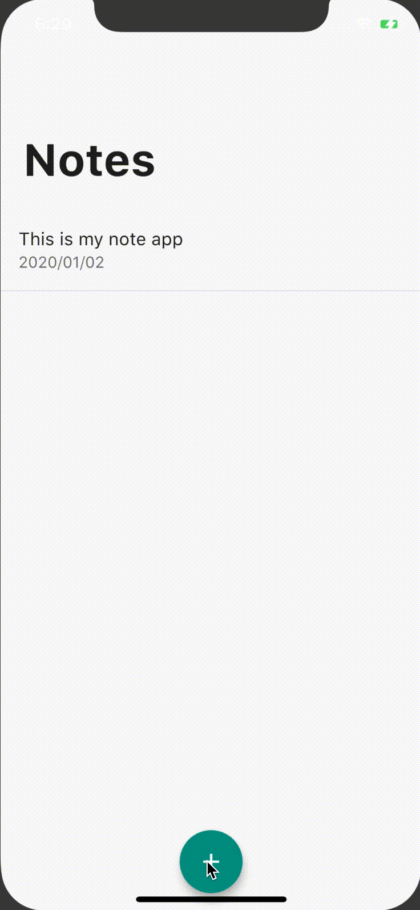

  

    
    <h1 align="center" style="font-size: 48px; font-weight: bold;">Note
    </h1>
  

  <h2 align="center">A simple note app built with Flutter
  </h2>

Note will be autosave and persistent with hive package like native app.

  

    
  

---

## Main Features

- Autosave & Persistent with local database
- Localization(only Japanese)

## Main Stack

- Bloc and Rxdart to autosave data
- Hive for locally persistent data

## About

This is a small personal project. Any comments and reactions would be awesome! Please check
[other projects](https://github.com/ykaito21/flutter_projects/blob/master/project_list.md) too.
